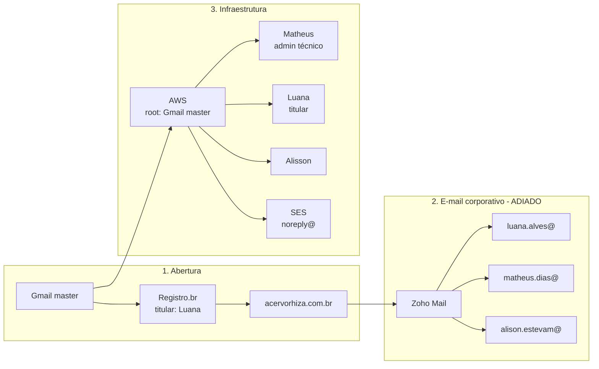

# 04 · Burocráticos

**Status:** 🔴 não iniciado · **Dono:** Matheus (técnico) / Luana (titular)
**Depende de:** —
**Alimenta:** [03 Canal de conteúdo](03-canal-de-conteudo.md)

> Reúne infraestrutura técnica (MEI, domínio, e-mail, AWS, GitHub, ClickUp), a automação de ManyChat no Instagram e o grupo de lançamento — o lado operacional/administrativo do projeto.

> ⚠️ **A parte de infraestrutura é do Acervo Rhíza, não só da Rosaninha.** Sustenta este produto e os próximos. Se vocês lançarem outros produtos, ela deve subir um nível na estrutura de pastas e ser referenciada, nunca copiada.

---

## Infraestrutura

**Status:** 🔴 não iniciado

> 💡 **Não depende de nada — pode começar hoje**, em paralelo com todo o resto. É a única frente nessa situação, e o Bloco 1 do lançamento ([03 Canal de conteúdo](03-canal-de-conteudo.md)) está travado esperando o MEI daqui.

### Decisões confirmadas

- `acervorhiza.master@gmail.com` é o e-mail de bootstrap **e** o e-mail root da AWS
- **Luana** é a titular legal do projeto/MEI
- **Matheus** é o administrador técnico, usando temporariamente o root da AWS
- **Alisson** também é pessoa de confiança na administração
- Os três terão meios de recuperação do Gmail master, **sem compartilhar senha**
- **E-mail com domínio próprio fica adiado**, para evitar despesa neste momento

### Pessoas e estrutura

| Pessoa | Papel |
|---|---|
| Matheus (matheus.dias) | Infra/Dev — AWS, GitHub, setup; administrador técnico |
| Alisson (alison.estevam) | Membro da banda; pessoa de confiança na administração |
| Luana (luana.alves) | MEI — dona do CNPJ; titular legal |

- **Empresa**: MEI da Luana (CNPJ já existe ou será aberto por ela)
- **Domínio principal**: `acervorhiza.com.br` — decidido **sem hífen**
- **Domínio de proteção (opcional)**: `acervo-rhiza.com.br` (~R$45/ano, redirect 301)

> ℹ️ Grafia confirmada: **alison** com um S só.

### E-mails

| E-mail | Provedor | Uso |
|---|---|---|
| `matt.kainos@gmail.com` | Gmail pessoal | Matheus — ClickUp e administração técnica |
| `alisonestevam@gmail.com` | Gmail pessoal | Alisson — ClickUp |
| `lavds.designer@gmail.com` | Gmail pessoal | Luana — ClickUp e contatos |
| E-mail com domínio próprio | **Adiado** | Contratar somente quando houver necessidade real |
| `noreply@acervorhiza.com.br` | **AWS SES** | Transacional do sistema (agendamento, confirmações, Lambda) |

#### ⚠️ Regra de ouro: Zoho = pessoas, SES = máquina

- **Nunca** usar o Zoho para disparo automático ou volumétrico — viola os termos e queima a reputação do domínio
- **Nunca** usar o SES para e-mail "de pessoa" — não tem caixa de leitura, só envio
- O Lambda chama **SES**, nunca o Zoho
- Os dois coexistem no mesmo domínio: o SPF tem os dois `include`s

#### Regra de segurança: e-mail admin fora da AWS

Alertas da conta AWS (faturamento, CloudWatch, SNS) vão para um e-mail **fora da AWS**, nunca num WorkMail interno.

Se a conta AWS cair ou for suspensa, você não perde justamente o e-mail que te avisa sobre a AWS.

### Arquitetura

```
┌─ Domínio: acervorhiza.com.br (Registro.br, CNPJ do MEI da Luana)
│
├─ E-mail CORPORATIVO (pessoas): Zoho Mail Free
│    (ADIADO para reduzir custos)
│    → o ClickUp usará os e-mails pessoais inicialmente
│
├─ E-mail TRANSACIONAL (sistema): AWS SES
│    noreply@acervorhiza.com.br
│
├─ Backend: AWS (Lambda + DynamoDB + SNS)
│    Root: acervorhiza.master@gmail.com
│    Matheus: admin técnico via root temporariamente (IAM futuro)
│    Luana: titular e administradora
│
├─ Código: GitHub (org da banda)
│    Actions (OIDC → IAM Role, SEM access key fixa) → build/deploy → AWS
│
└─ Tarefas: ClickUp Free
     Tarefas ⇄ Issues ⇄ PRs (feat/CUP-42-xxx)
```



**Como ler**: são três coisas separadas. O Gmail master abre as contas e é o root da AWS. O domínio pertence à Luana. Cada pessoa usa acesso AWS individual. O root não é usado no dia a dia.

### Custos iniciais

| Item | Custo |
|---|---|
| Registro.br (domínio) | ~R$45/ano |
| E-mail corporativo com domínio | R$0 agora (adiado) |
| ClickUp Free | R$0 |
| GitHub Free | R$0 |
| AWS (free tier + uso real) | Baixo — monitorar billing |
| Cloudflare (DNS) | R$0 |

### Ordem de execução

> **Princípio**: o Gmail master é a chave de abertura e o root da AWS. Não vira endereço corporativo — fica protegido para recuperação e root.

#### Passo 0 — E-mail de bootstrap
- [ ] Criar e usar `acervorhiza.master@gmail.com`
- [ ] Ativar 2FA, recuperação e guardar os códigos de backup
- [ ] Dar acesso aos meios de recuperação para Luana e Alisson (cada um com seu 2FA)

#### Passo 1 — CNPJ (Luana)
- [ ] Luana abre ou valida o MEI dela → CNPJ pronto

> 🔗 **Trava o Bloco 1 do lançamento** ([03 Canal de conteúdo](03-canal-de-conteudo.md)): sem CNPJ não dá pra cadastrar o produto na Kiwify.

#### Passo 2 — Registro.br
- [ ] Registrar `acervorhiza.com.br` (+ `acervo-rhiza.com.br` se quiser)

Matheus pode criar e configurar a conta, mas os dados do titular devem ser os da **Luana**, com CPF dela e CNPJ do MEI quando aplicável.

E-mail de contato inicial: o Gmail master.

> ℹ️ 1 CPF = 1 conta no Registro.br, mas a conta registra domínios ilimitados.

#### Passo 3 — DNS
- **Opção A (recomendada)**: Cloudflare gratuito → adicionar domínio → trocar os `dns1.dns.publico.br` pelos DNS do Cloudflare
- **Opção B**: DNS público do Registro.br — funciona, interface mais datada

#### Passo 4 — E-mail com domínio próprio *(adiado)*
- Não contratar Zoho nem WorkMail agora
- O ClickUp aceita os e-mails pessoais
- O SES segue separado — não exige caixa de entrada

#### Passo 5 — Registros DNS *(quando o e-mail corporativo entrar)*
1. Registros do Zoho: MX, CNAME de autenticação, TXT/SPF, DKIM
2. SES (ver seção abaixo)
3. DMARC: TXT em `_dmarc` = `v=DMARC1; p=none;`
4. Verificar domínio no Zoho (minutos a ~24h)
5. Testar em [mail-tester.com](https://www.mail-tester.com) e [mxtoolbox.com](https://mxtoolbox.com)

#### Passo 6 — AWS
- [ ] Definir se reutiliza a conta atual ou cria uma nova

**Se a AWS atual já contém os recursos do Acervo Rhíza**: reutilizar e alterar o e-mail root para o Gmail master. Precisa de acesso ao root atual e ao novo Gmail. Mantém Account ID, recursos, histórico e cobrança.

**Se a AWS atual for pessoal ou de outro projeto**: não trocar o e-mail. Criar conta separada.

- [ ] Nome da conta: `Acervo Rhiza`
- [ ] Root protegido com MFA, usado só em emergência
- [ ] Cobrança e dados fiscais conforme o MEI da Luana
- [ ] Acesso administrativo próprio para Luana
- [ ] Acesso próprio para Alisson conforme a necessidade
- [ ] Deploy via OIDC do GitHub Actions → Role IAM

> ⚠️ Matheus opera temporariamente pelo root. Futuramente: identidade técnica via IAM Identity Center com `AdministratorAccess`. Nunca compartilhar o root para trabalho diário.

#### Passo 7 — Ajuste dos e-mails de administração
*(Só depois de tudo funcionando e testado.)*
- Registro.br: manter titularidade no CPF/CNPJ da Luana
- AWS: manter o Gmail master como root
- Contatos alternativos da AWS: cobrança, operações e segurança separados

> ⚠️ Só remover ou alterar um e-mail quando o novo estiver confirmado e com MFA.

#### Passo 8 — ClickUp
- [ ] Criar workspace com o Gmail master como owner central
- [ ] Convidar os três como usuários individuais
- [ ] Listas iniciais (Tarefas / Em andamento / Concluídas), calendário editorial, backlog

A conta master **não** é usada para tarefas diárias.

> **Limitações do Free**: 60 MB de arquivos, 5 Spaces. Arquivos grandes → Google Drive ou S3.

#### Passo 9 — GitHub
- [ ] Org da banda — login com e-mail pessoal serve
- [ ] Integração nativa ClickUp ⇄ GitHub (OAuth)
- [ ] Convenção de branch: `feat/CUP-42-nova-feature`
- [ ] Workflow: `build → test → deploy (OIDC → AWS)`

**Opcional**: step no Actions chamando a API do ClickUp pra comentar na tarefa pós-deploy.

### SES — configuração completa

1. Console AWS → **SES** → *Verified identities* → **Verify a new domain** → `acervorhiza.com.br`
2. A AWS gera CNAMEs para `dkim.*` e um TXT `_amazonses`
3. **Atalho**: criar um TXT único com o token do `_amazonses` — verifica o domínio e ativa os 3 DKIM de uma vez
4. Colar no DNS ao lado dos registros do Zoho
5. **SPF: uma única linha com os dois includes.** Não criar dois registros SPF:
   ```
   v=spf1 include:zoho.com include:email-smtp.<regiao>.amazonaws.com ~all
   ```
   Ex.: `email-smtp.sa-east-1.amazonaws.com` para São Paulo
6. Confirmar que o domínio aparece como **Verified**
7. Para enviar com `noreply@`, o e-mail também precisa ser verificado — ou usar *Easy mode* com o domínio verificado
8. Free tier: ~6.200 e-mails/dia (confirmar no console)

#### Check de coexistência
- `mxtoolbox.com` deve mostrar: MX do Zoho, SPF com os 2 includes, DKIM do Zoho e do SES, DMARC
- Teste pelo Zoho e teste pelo SES/Lambda → mail-tester
- Ambos devem pontuar alto, com DKIM "pass"

### Segurança

- [ ] 2FA no Gmail master
- [ ] Códigos de backup guardados com Matheus, Luana e Alisson
- [ ] Gmail master como root, só em emergência
- [ ] Cada pessoa com seu próprio 2FA, sem compartilhar senha
- [ ] 2FA nas caixas corporativas (quando existirem)
- [ ] Futuramente: IAM/Identity Center separado para Matheus
- [ ] Acesso administrativo próprio para Luana
- [ ] Acesso próprio para Alisson
- [ ] Alertas de billing → contatos de cobrança
- [ ] Alertas operacionais → e-mail administrativo fora da AWS
- [ ] GitHub: 2FA na org, deploy via OIDC
- [ ] DMARC em `p=none`; evoluir para `p=quarantine`/`p=reject`
- [ ] CloudWatch: budget alert

### Riscos e limites conhecidos

| Item | Limite / risco | Mitigação |
|---|---|---|
| Zoho Free | 5 usuários, 5 GB/caixa, 1 domínio | Plano pago (US$1-4/usuário) |
| Zoho Free | Sem calendário compartilhado | Google Calendar pessoal, ou Cal.com |
| ClickUp Free | Upload 100 MB/membro, automações limitadas | Arquivos grandes → S3 |
| Domínio novo | Reputação zero com filtros de spam | SPF + DKIM + DMARC desde o dia 1 |
| AWS | Fatura surpresa | Budget alert + só serverless |
| Registro.br | Suporte burocrático | E-mail secundário sempre ativo |

### Decisões futuras

*Reavaliar em ~3-4 meses.*

- **Zoho Free apertou?** → pago ou migrar; e-mail é portável por IMAP
- **ClickUp Free apertou?** → pago (~US$7/usuário) ou migrar
- **Calendário compartilhado de verdade?** → Google Workspace ou 365 all-in-one

> ❌ **O que não fazer**: stack à la carte paga (Slack Pro + Zoom + ClickUp pago) ≈ US$25-30/usuário, mais caro que all-in-one.

### Decisões abertas — Infraestrutura

| Decisão | Contexto |
|---|---|
| Reutilizar conta AWS atual ou criar nova | Passo 6 |
| Quando migrar Matheus do root para IAM | Hoje opera pelo root, por decisão |
| Esta seção sobe um nível de pasta? | Se o Acervo lançar mais produtos |

---

## ManyChat para posts do Instagram

**Status:** 🔴 não iniciado

### Objetivo

Usar comentários e mensagens do Instagram para iniciar uma conversa automatizada, entregar um recurso útil e levar a pessoa para o próximo passo. A automação deve parecer uma ajuda, não um robô empurrando oferta.

### Fluxo inicial

1. Publicar um post com uma palavra-chave clara.
2. A pessoa comenta a palavra-chave.
3. ManyChat responde e solicita autorização para enviar a mensagem.
4. Entregar a isca digital ou o link escolhido.
5. Perguntar se a pessoa conseguiu acessar.
6. Apresentar um próximo conteúdo relacionado.
7. Convidar para a lista de espera ou página de vendas quando houver contexto.

### Exemplo de CTA

> Comente **ROTINA** e eu te envio o checklist para começar sem tentar resolver a casa inteira de uma vez.

A palavra-chave deve ser curta, fácil de escrever e exclusiva da campanha.

### Mensagens

#### Resposta pública

> Te enviei uma mensagem com o checklist. Se ela não aparecer, confira as solicitações do Instagram.

#### Primeira mensagem privada

> Oi! Posso te enviar o checklist de rotina possível?

#### Entrega

> Aqui está o material: [link]. Comece pela primeira página e escolha apenas uma ação para hoje.

#### Continuação

> Qual parte da rotina mais pesa para você: roupa, comida ou organização da casa?

A resposta pode alimentar segmentação e pesquisa, mas não deve ser usada para pressionar a pessoa.

### Boas práticas

- Pedir consentimento antes de enviar mensagens recorrentes.
- Explicar por que a pessoa está recebendo o contato.
- Oferecer saída fácil da sequência.
- Não enviar spam nem repetir mensagens.
- Usar links rastreáveis.
- Testar o fluxo em contas diferentes antes de divulgar.
- Manter uma alternativa manual para quem não consegue usar a automação.

### Métricas

- Comentários com a palavra-chave.
- Conversas iniciadas.
- Entrega e clique na isca.
- Respostas à pergunta de segmentação.
- Leads qualificados.
- Conversão para página e compra.
- Bloqueios, denúncias e mensagens ignoradas.

### Checklist técnico

- Conta do Instagram profissional conectada.
- Permissões do ManyChat revisadas.
- Palavra-chave e gatilho testados.
- Link da isca funcionando.
- UTM configurada.
- Mensagens aprovadas e revisadas.
- Evento de conversão documentado.
- Fluxo de saída disponível.

---

## Grupo de lançamento

**Status:** 🔴 não iniciado

### Objetivo

Criar um grupo pequeno de pessoas interessadas antes de o ebook estar pronto. O grupo serve para cultivar relacionamento, ouvir a linguagem real da audiência, testar decisões do produto e preparar uma pré-venda — não para disparar anúncios diariamente.

A comunidade deve fazer a pessoa sentir que está acompanhando e ajudando a construir algo útil.

### Funil

```text
Conteúdo orgânico
        ↓
ManyChat / link de entrada
        ↓
Grupo de lançamento
        ↓
Pesquisa + bastidores + conteúdo útil
        ↓
Lista de espera / pré-venda
        ↓
Ebook
```

### Formato recomendado

Começar com um grupo de WhatsApp, caso o público já use esse canal. Se a quantidade crescer ou o grupo ficar barulhento, migrar para uma comunidade com canais separados ou usar uma lista de transmissão para avisos.

O formato deve ser definido antes de divulgar. Não criar grupo sem alguém responsável por moderar e responder.

### Promessa de entrada

A promessa precisa ser específica e honesta. Exemplo:

> Entre para acompanhar a construção da Rosaninha, receber ferramentas práticas para uma rotina mais leve e participar primeiro da abertura do ebook.

Não prometer desconto, conteúdo ou acesso que ainda não esteja definido.

### O que publicar

#### Frequência

- 2 conteúdos úteis por semana.
- 1 bastidor ou atualização do projeto por semana.
- 1 pergunta ou enquete por semana.
- Avisos de oferta somente quando houver uma decisão clara para a pessoa tomar.

#### Conteúdos

- Trechos e aprendizados das entrevistas com a mãe.
- Checklists curtos e exercícios do ebook.
- Enquetes sobre dores, linguagem e formato.
- Bastidores da escrita e da diagramação.
- Testes de capa, nome, promessa e preço.
- Prévia de páginas e ferramentas.
- Avisos antecipados da pré-venda.

### Fases

#### 1. Fundação do grupo

- Definir nome, descrição e regra de convivência.
- Criar mensagem de boas-vindas.
- Preparar pelo menos duas semanas de conteúdo antes de convidar pessoas.
- Definir o canal de suporte e o responsável pela moderação.

#### 2. Aquecimento

- Convidar a audiência mais engajada.
- Fazer perguntas abertas e registrar padrões.
- Entregar uma primeira ferramenta útil rapidamente.
- Evitar vender antes de existir confiança e contexto.

#### 3. Validação

- Testar nome, promessa, capa, formato e preço.
- Apresentar uma prévia real do ebook.
- Perguntar o que faria a pessoa comprar ou não comprar.
- Abrir uma lista de interesse para medir intenção, não apenas curiosidade.

#### 4. Pré-venda

- Explicar o que está pronto e o que ainda será entregue.
- Informar preço, prazo, formato e suporte.
- Oferecer condição de fundadora somente se ela fizer sentido financeiramente.
- Confirmar que checkout, entrega e atendimento estão funcionando.

#### 5. Lançamento

- Avisar o grupo antes dos canais públicos.
- Entregar o link de compra com uma instrução simples.
- Responder dúvidas sem pressão.
- Agradecer, acompanhar as primeiras clientes e coletar feedback autorizado.

### Regras de convivência

- O grupo não é lugar para spam ou corrente.
- Respeitar privacidade e não expor mensagens sem autorização.
- Não prometer resultado garantido.
- Evitar excesso de mensagens e notificações.
- Deixar claro como sair do grupo.
- Se houver coleta de dados, informar finalidade e permitir descadastro.

### Métricas

Acompanhar qualidade, não só tamanho:

- pessoas convidadas e pessoas que entram;
- visualizações e respostas;
- participação nas pesquisas;
- cliques na lista de espera;
- intenção de compra;
- vendas na pré-venda;
- silenciamentos, saídas e reclamações.

Um grupo menor e participativo vale mais que uma lista grande sem resposta.

### Integração com ManyChat

Posts com uma palavra-chave podem iniciar o convite. O fluxo deve:

1. entregar uma ferramenta ou contexto antes do convite;
2. explicar o que existe no grupo;
3. enviar o link correto;
4. marcar a origem da pessoa com UTM ou etiqueta;
5. não adicionar ninguém sem ação ou consentimento.

Ver a seção ManyChat para posts do Instagram, acima.

### Decisões abertas — Grupo de lançamento

- WhatsApp, comunidade ou outro canal.
- Nome do grupo e promessa de entrada.
- Isca usada para atrair as primeiras pessoas.
- Frequência máxima de mensagens.
- Oferta e benefício da pré-venda.
- Responsável pela moderação.
- Critério para abrir ou fechar novas entradas.
